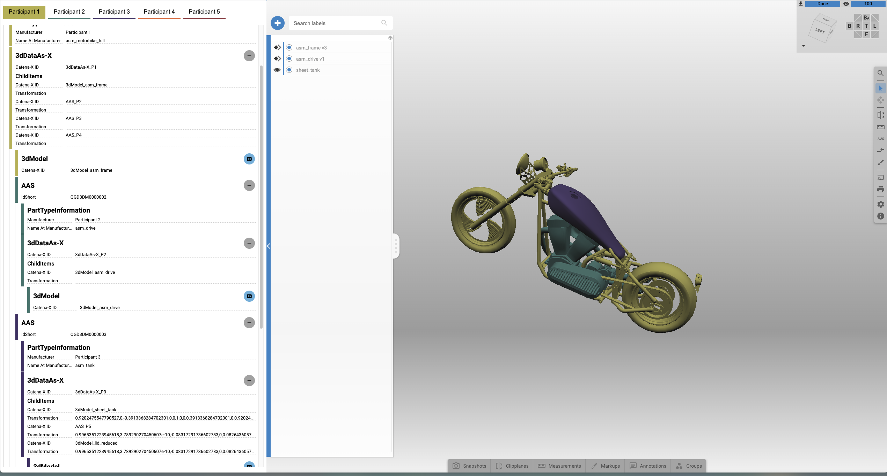

# Catena-X Demo

Authors: [Hannes Krug](hannes.krug@threedy.io), [Niklas Fix](niklas.fix@threedy.io), [Sarah Berkei](sarah.berkei@threedy.io)

[TOC]

## Description

This repository demonstrates how 3D engineering data can be integrated into the [Catena-X standard](https://catenax-ev.github.io/docs/standards/overview), paving the way for richer, cross-company collaboration.
It delivers two main outcomes:
- Demonstration Code – A working prototype that visualizes how 3D Aspect Models could be used in a cross-company scenario using mock data and the webvis viewer.
- Proposal Document (Version 1) – An initial proposal that outlines how Catena-X could be expanded through new 3D-specific Aspect Models (e.g., 3dDataAs-X, 3dModel) to support collaborative 3D data usage across the supply chain.

By extending existing Aspect Models and introducing new 3D-specific ones, this project addresses current limitations in how 3D content is represented and exchanged within Catena-X. These additions allow for more than just static data exchange—they enable interactive, traceable, and hierarchical sharing of 3D data across supply chain partners.
The approach strengthens interoperability between companies, increases transparency in complex product structures, and offers a clear path to visualize and manage geometry-rich data through Asset Administration Shells (AAS) and Catena-X.

Checkout short video introduction: https://www.loom.com/share/b80341945a864c5d90c2a8673bba4fb1?sid=a078be8b-2d92-4ec5-9f31-9724c40cc544

{width=450px}


## Proposal
The proposal PDF can be found in `./doc` alongside with two sketches depicting two different cases of 3D data exchange describe in detail in the PDF. Please note that the current implementation is based on **case 2**.

## Run the project

### Preconditions

The demo is built up on the [instant3Dhub](https://www.threedy.io/), specifically version `3.10.5`.

The embedded instant3Dhub instance might change or become unavailable in the futrure. You can link the project to a running hub version anytime by following the next two steps:

1. Change the path to the `webvis.js` inside the `index.html` file.
2. Adjust the `hubURL` path to your instance in the `webvis.config.json` file.

### Run

To run the demo locally, call

```bash
npm i
npm run dev
```

and click on the link in the terminal (e.g. http://localhost:5173).

## Configuration

### App Environmental Variables

Use the `.env` file in the root directory to configure application specific configurations. Currently, there is only the `VITE_CX_DATA_URL` which allows you to set the path from which your Catena-X (mocked) data JSON files lie.

### Webvis Config JSON

Use the `webvis.config.json` file in the root directory to configure webvis to your requirements if needed (see the [official docs](https://docs.threedy.io/3.10.5/tutorials/dev_tutorials/tutorials/settings.html))

## How to use

When running the app you will see a panel "Catena-X View" to the left and the webvis viewer to the right.

Start by having a look at the panel (Catena-X View) to the left. At the top, you can see a list of participants ("Participant 1", "Participant 2", etc.). Initially, we start by showing the Catena-X aspect models relevant from the perspective of participant 1, specifically, the Asset Administration Shell (AAS) of this participant.

The AAS tile contains some meta information about this specific AAS as stored in the corresponding JSON file. On the right side of the tile you can see a button ("+"). By clicking it, you can expand the view to get a deeper perspective on the linked aspect models of the current tile.

An AAS tile, for instance, links to the three tiles "PartTypeInformation", "3dDataAs-X" and "SingleLevelBOMAs-X". The last two in turn link to further, deeper aspect models in the hierarchy. Click again on the expand button ("+") to gain more insights on their child items or press ("-") to collapse the view again.

When reaching a "3dModel" tile / aspect model you might notice there is another kind of button ("3D") displayed next to it. By clicking this button, you can visualize the corresponding 3D asset leveraging the webvis viewer to the right. Click the button again, to remove the 3D asset from the webvis viewer.

Moreover, you might have noticed the thin color stripe to the left side of each tile. As you may have noticed, its color within the tree view is from the same color palette as the colors in the participant list on the top. It indicates the ownership of each aspect model as specified in the Catena-X models. When rendering a 3dModel aspect in the webvis viewer, the viewer will colorize the 3D asset in the corresponding color as well. By this, we stress out which 3D asset is owned by which participant.

Some tiles are grayed out and show a lock icon on their right side. This indicates that the currently selected participant is (contractually) not allowed to access the respective aspect model ([One-up, one-down principle](https://catena-x.academy/glossary/) of Catena-X).

Lastly, you might want to switch the participant perspective by clicking on another participant in the list at the top.

## Notes

### Tractus-X

This project is held very simple and is thought just as a first demonstration or showcase. A proper integration of our solution into the Catena-X ecosystem would likely mean a deeper investigation of [Eclipse Tractus-X](https://github.com/eclipse-tractusx).
